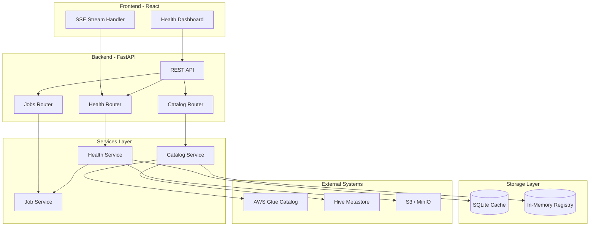
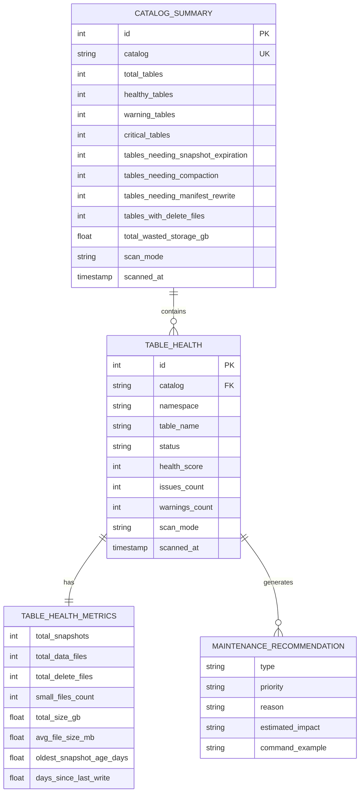
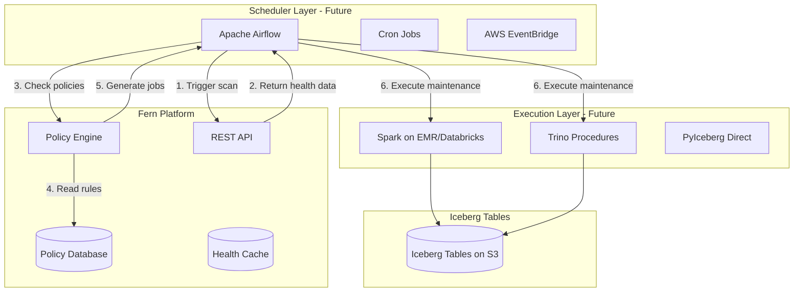
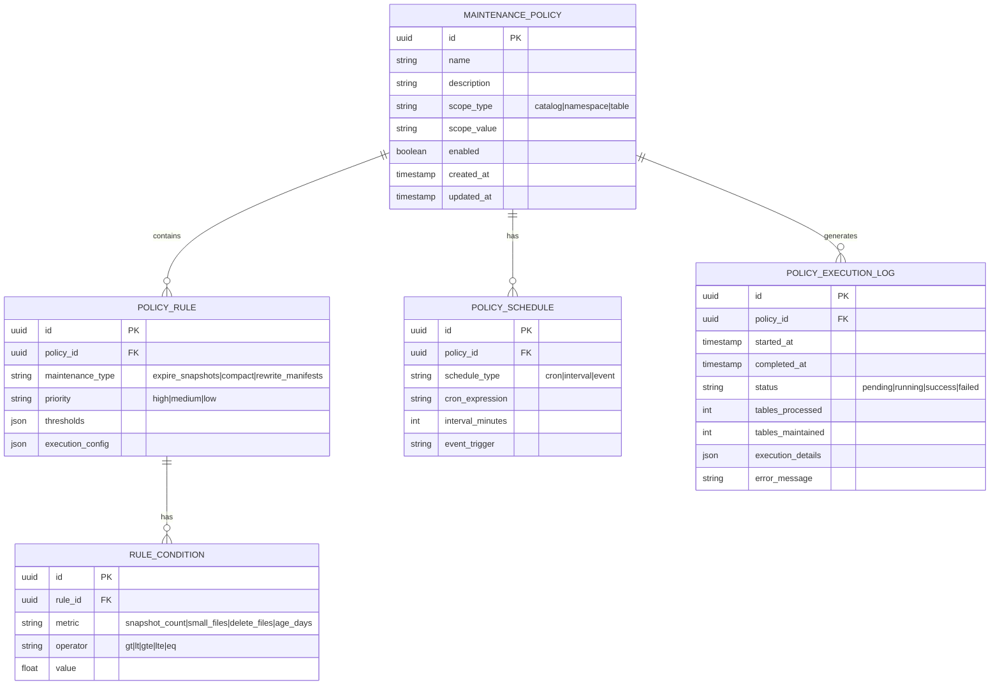

# Iceberg Maintenance Architecture Documentation

## Deliverable

Create `docs/ARCHITECTURE.md` with comprehensive documentation covering:

1. **Current System Architecture** - How Fern works today
2. **Data Model (ER Diagram)** - Database schema and Pydantic models
3. **Future Architecture** - Scheduler integration, Spark jobs, policy engine

---

## Document Structure

### Section 1: System Overview

High-level description of Fern as an Iceberg metadata visualization and maintenance platform.

### Section 2: Current Architecture Diagram

### Section 3: Data Model (ER Diagram)

### Section 4: Future Architecture - Scheduler Integration

### Section 5: Policy-Based Maintenance Schema (Future)

### Section 6: Component Descriptions

Document each component:

- **CatalogService**: In-memory registry for Iceberg catalog connections
- **HealthService**: Table health analysis with light/full scan modes
- **HealthCache**: SQLite persistence for health scan results
- **JobService**: In-process background task execution
- **Streaming**: SSE-based real-time progress updates

### Section 7: Future Roadmap

- **Phase 1**: Policy Engine (define rules, store in DB)
- **Phase 2**: Scheduler Integration (Airflow DAG templates)
- **Phase 3**: Execution Backends (Spark/Trino command generation)
- **Phase 4**: Observability (execution history, cost tracking)

---

## Files to Create

| File                   | Description                                  |
| ---------------------- | -------------------------------------------- |
| `docs/ARCHITECTURE.md` | Main architecture document with all diagrams |

## Key Diagrams Included

1. **System Architecture** - Current component layout
2. **ER Diagram - Current** - SQLite cache schema + Pydantic models
3. **Future Architecture** - Scheduler + execution layer
4. **ER Diagram - Future** - Policy-based maintenance schema
5. **Data Flow** - How health scans work end-to-end

