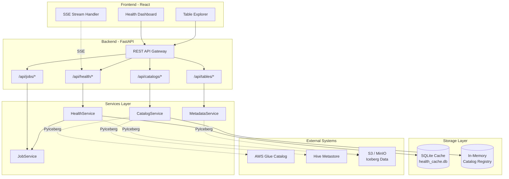
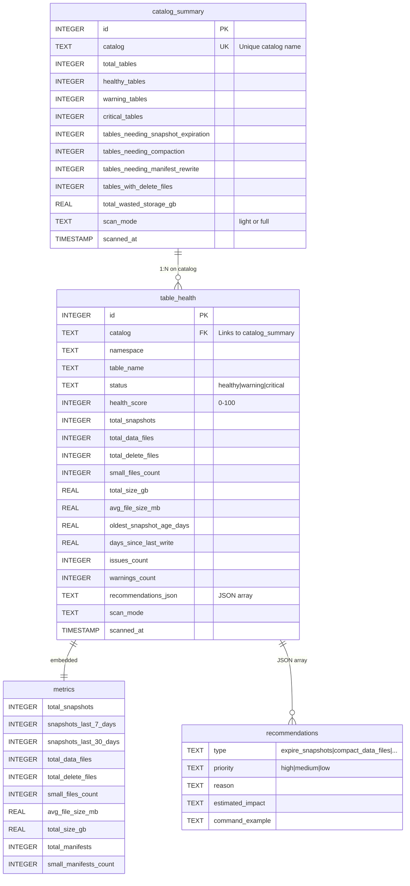
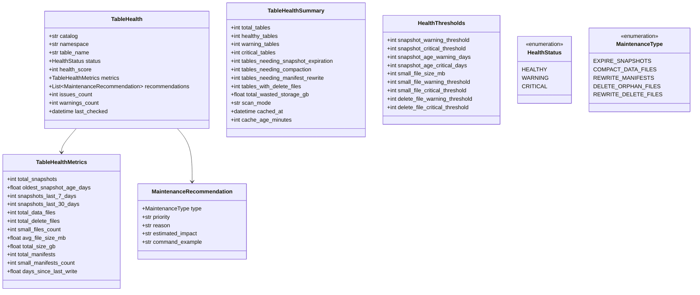
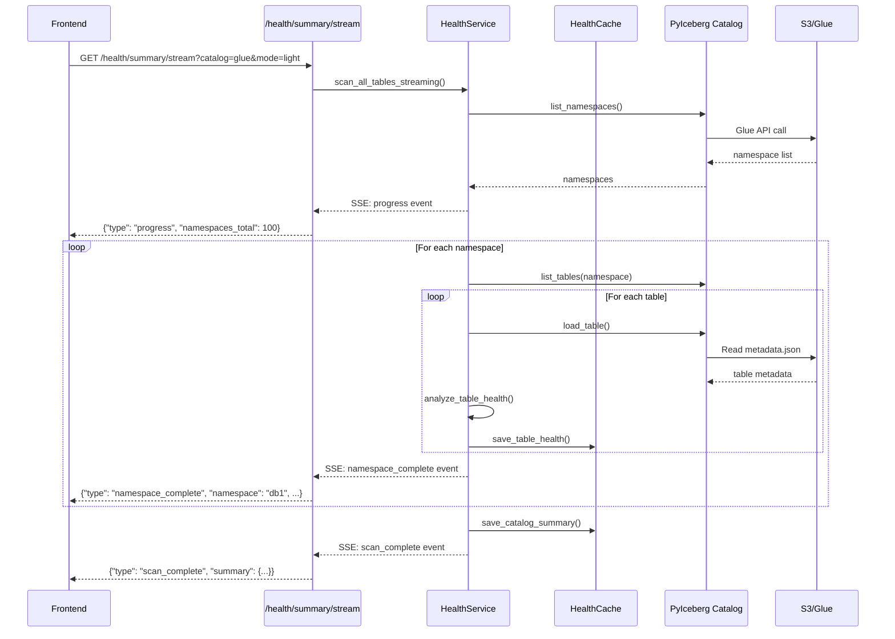
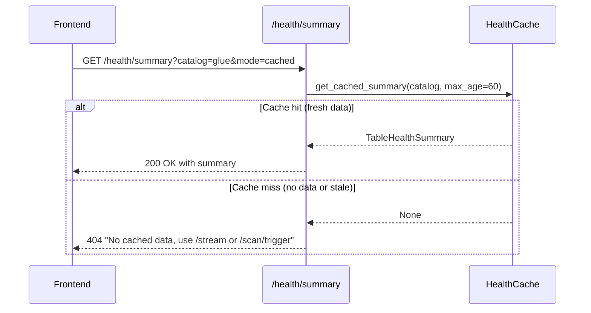
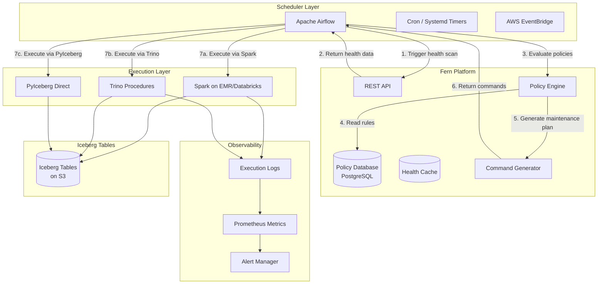
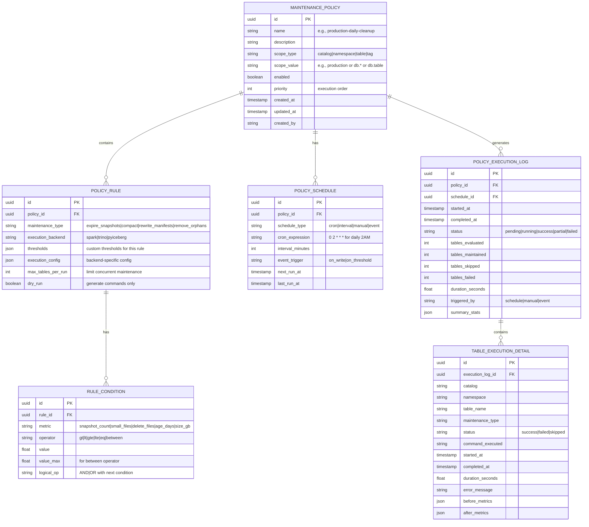

# Fern - Iceberg Maintenance Platform Architecture

## Table of Contents

1. [Overview](#overview)
2. [Current System Architecture](#current-system-architecture)
3. [Data Model](#data-model)
4. [Component Details](#component-details)
5. [API Endpoints](#api-endpoints)
6. [Data Flow](#data-flow)
7. [Future Architecture](#future-architecture)
8. [Policy-Based Maintenance](#policy-based-maintenance)
9. [Roadmap](#roadmap)

---

## Overview

**Fern** is an Apache Iceberg metadata visualization and maintenance platform. It provides:

- **Catalog Management**: Connect to Hive Metastore or AWS Glue catalogs
- **Health Monitoring**: Analyze table health metrics (snapshots, small files, delete files)
- **Maintenance Recommendations**: Generate actionable maintenance commands
- **Real-time Streaming**: SSE-based progress updates for large catalog scans
- **Caching**: SQLite-based health data caching for instant dashboard loads

### Technology Stack

| Layer | Technology |
|-------|------------|
| Frontend | React, TypeScript, TailwindCSS, React Query |
| Backend | Python, FastAPI, Pydantic |
| Catalog Integration | PyIceberg, boto3 |
| Storage | SQLite (cache), In-memory (catalog registry) |
| External Systems | AWS Glue, Hive Metastore, S3/MinIO |

---

## Current System Architecture



### Architecture Principles

1. **Stateless API**: Backend is stateless except for in-memory catalog connections
2. **Cache-First**: Health data is cached in SQLite for instant retrieval
3. **Streaming for Scale**: Large catalogs use SSE streaming for real-time progress
4. **External Execution**: Fern does not execute maintenance; it generates commands for Spark/Trino

---

## Data Model

### Current Schema (SQLite Cache)



### Pydantic Models (API Layer)



---

## Component Details

### CatalogService

**Location**: `backend/app/services/catalog_service.py`

**Purpose**: Manages connections to Iceberg catalogs (Glue, Hive)

**Storage**: In-memory dictionaries (`_catalogs`, `_configs`)

**Key Operations**:
| Method | Description |
|--------|-------------|
| `register_catalog()` | Connect to a new catalog, normalize credentials |
| `get_catalog()` | Get PyIceberg Catalog instance |
| `list_catalogs()` | List all registered catalogs with optional stats |
| `test_catalog()` | Verify connectivity by listing namespaces |
| `remove_catalog()` | Disconnect and remove from registry |

**Credential Handling**:
- Glue: Maps boto3-style keys to PyIceberg `client.*` format
- S3: Auto-propagates Glue credentials to `s3.*` properties
- MinIO: Sets `s3.path-style-access=true` when endpoint is configured

### HealthService

**Location**: `backend/app/services/health_service.py`

**Purpose**: Analyzes table health and generates maintenance recommendations

**Scan Modes**:
| Mode | Speed | S3 Calls | Metrics Available |
|------|-------|----------|-------------------|
| `light` | Fast | None | Snapshots, file counts from metadata.json |
| `full` | Slow | Many | All metrics including small file detection |

**Key Operations**:
| Method | Description |
|--------|-------------|
| `analyze_table_health()` | Single table health analysis |
| `scan_all_tables()` | Batch scan with progress updates |
| `scan_all_tables_streaming()` | Generator yielding namespace-by-namespace results |
| `run_background_scan()` | Full scan with caching |

**Health Score Calculation**:
```
score = 100
score -= (high_priority_issues * 20)
score -= (medium_priority_issues * 10)
score -= (low_priority_issues * 5)

status = HEALTHY if score >= 80
status = WARNING if score >= 60
status = CRITICAL if score < 60
```

### HealthCache

**Location**: `backend/app/services/health_cache.py`

**Purpose**: SQLite-based persistence for health scan results

**Database**: `backend/app/data/health_cache.db`

**Tables**:
- `table_health`: Per-table health data with metrics
- `catalog_summary`: Aggregate statistics per catalog

**Key Operations**:
| Method | Description |
|--------|-------------|
| `save_table_health()` | Upsert table health (INSERT OR REPLACE) |
| `save_catalog_summary()` | Upsert catalog summary |
| `get_cached_summary()` | Get summary if fresh (within max_age_minutes) |
| `get_tables_by_status()` | Query tables filtered by health status |
| `get_tables_needing_maintenance()` | Query tables by maintenance criteria |

### JobService

**Location**: `backend/app/services/job_service.py`

**Purpose**: In-process background task execution

**Executor**: `ThreadPoolExecutor` with 4 workers

**Storage**: In-memory dictionary (jobs lost on restart)

**Job Lifecycle**:
```
PENDING → RUNNING → COMPLETED
                  → FAILED
```

**Key Operations**:
| Method | Description |
|--------|-------------|
| `create_job()` | Create new job with UUID |
| `run_in_background()` | Submit task to thread pool |
| `update_job()` | Update progress/message (called by workers) |
| `get_job()` | Get job status |
| `cleanup_old_jobs()` | Remove completed jobs older than threshold |

---

## API Endpoints

### Health Endpoints (`/api/health`)

| Method | Endpoint | Description |
|--------|----------|-------------|
| GET | `/summary` | Get cached health summary (mode: cached/light/full) |
| GET | `/summary/stream` | SSE streaming health scan |
| GET | `/tables/{ns}/{table}` | Single table health |
| GET | `/tables/cached` | Query cached table health with filters |
| GET | `/cache/info` | Cache status (age, table count) |
| DELETE | `/cache` | Clear cached data for catalog |
| POST | `/scan/trigger` | Trigger background scan |

### Catalog Endpoints (`/api/catalogs`)

| Method | Endpoint | Description |
|--------|----------|-------------|
| GET | `/` | List all catalogs |
| POST | `/` | Register new catalog |
| POST | `/async` | Register catalog with progress tracking |
| GET | `/{name}` | Get catalog info |
| GET | `/{name}/test` | Test catalog connectivity |
| DELETE | `/{name}` | Remove catalog |

### Job Endpoints (`/api/jobs`)

| Method | Endpoint | Description |
|--------|----------|-------------|
| GET | `/` | List all jobs |
| GET | `/{id}` | Get job status |
| GET | `/{id}/stream` | SSE job progress stream |
| DELETE | `/{id}` | Delete job |
| POST | `/cleanup` | Remove old completed jobs |

---

## Data Flow

### Health Scan Flow (Streaming)



### Cached Request Flow



---

## Future Architecture

### Scheduler Integration



### Airflow DAG Example (Future)

```python
# Example DAG for automated Iceberg maintenance
from airflow import DAG
from airflow.operators.python import PythonOperator
from airflow.providers.http.operators.http import SimpleHttpOperator
from datetime import datetime, timedelta

default_args = {
    'owner': 'data-platform',
    'retries': 1,
    'retry_delay': timedelta(minutes=5),
}

with DAG(
    'iceberg_maintenance',
    default_args=default_args,
    schedule_interval='0 2 * * *',  # Daily at 2 AM
    start_date=datetime(2024, 1, 1),
    catchup=False,
) as dag:
    
    # Step 1: Trigger health scan
    trigger_scan = SimpleHttpOperator(
        task_id='trigger_health_scan',
        http_conn_id='fern_api',
        endpoint='/api/health/scan/trigger',
        method='POST',
        data={'catalog': 'production', 'mode': 'light'},
    )
    
    # Step 2: Wait for scan completion
    wait_for_scan = PythonOperator(
        task_id='wait_for_scan',
        python_callable=poll_job_completion,
    )
    
    # Step 3: Get tables needing maintenance
    get_maintenance_tasks = SimpleHttpOperator(
        task_id='get_maintenance_tasks',
        http_conn_id='fern_api',
        endpoint='/api/health/tables/cached',
        method='GET',
        data={'catalog': 'production', 'status_filter': 'critical'},
    )
    
    # Step 4: Execute maintenance via Spark
    run_maintenance = SparkSubmitOperator(
        task_id='run_spark_maintenance',
        application='/opt/spark/maintenance.py',
        conf={'spark.sql.catalog.iceberg': 'org.apache.iceberg.spark.SparkCatalog'},
    )
    
    trigger_scan >> wait_for_scan >> get_maintenance_tasks >> run_maintenance
```

---

## Policy-Based Maintenance

### Policy Schema (Future)



### Policy Examples

#### Example 1: Aggressive Snapshot Cleanup

```json
{
  "name": "aggressive-snapshot-cleanup",
  "description": "Expire snapshots for high-write tables",
  "scope_type": "namespace",
  "scope_value": "analytics.*",
  "enabled": true,
  "rules": [
    {
      "maintenance_type": "expire_snapshots",
      "execution_backend": "trino",
      "conditions": [
        {"metric": "snapshot_count", "operator": "gt", "value": 30},
        {"metric": "days_since_last_write", "operator": "lt", "value": 7, "logical_op": "AND"}
      ],
      "execution_config": {
        "retain_last": 10,
        "older_than_days": 7
      }
    }
  ],
  "schedule": {
    "schedule_type": "cron",
    "cron_expression": "0 3 * * *"
  }
}
```

#### Example 2: Small File Compaction

```json
{
  "name": "small-file-compaction",
  "description": "Compact tables with many small files",
  "scope_type": "catalog",
  "scope_value": "production",
  "enabled": true,
  "rules": [
    {
      "maintenance_type": "compact_data_files",
      "execution_backend": "spark",
      "conditions": [
        {"metric": "small_files", "operator": "gt", "value": 100},
        {"metric": "avg_file_size_mb", "operator": "lt", "value": 64, "logical_op": "AND"}
      ],
      "execution_config": {
        "target_file_size_mb": 512,
        "max_concurrent_file_group_rewrites": 5
      },
      "max_tables_per_run": 10
    }
  ],
  "schedule": {
    "schedule_type": "cron",
    "cron_expression": "0 4 * * 0"
  }
}
```

---

## Roadmap

### Phase 1: Policy Engine (Current Focus)

- [ ] Design policy database schema
- [ ] Implement CRUD APIs for policies
- [ ] Build policy evaluation engine
- [ ] Add policy UI in dashboard

### Phase 2: Scheduler Integration

- [ ] Create Airflow DAG templates
- [ ] Implement webhook triggers for EventBridge
- [ ] Add cron-based internal scheduler option
- [ ] Build execution plan generator

### Phase 3: Execution Backends

- [ ] Spark command generator (expire, compact, rewrite)
- [ ] Trino procedure generator (CALL statements)
- [ ] PyIceberg direct execution (for small tables)
- [ ] Dry-run mode for command preview

### Phase 4: Observability

- [ ] Execution history dashboard
- [ ] Cost tracking (S3 API calls, compute time)
- [ ] Alerting on failed maintenance
- [ ] Trend analysis (health score over time)

### Phase 5: Advanced Features

- [ ] Multi-catalog policy inheritance
- [ ] Tag-based policy targeting
- [ ] Maintenance windows (avoid peak hours)
- [ ] Approval workflows for critical tables

---

## Appendix

### Maintenance Types

| Type | Description | Trino Command | Spark Command |
|------|-------------|---------------|---------------|
| `expire_snapshots` | Remove old snapshots | `CALL system.expire_snapshots(...)` | `table.expireSnapshots().olderThan(ts).commit()` |
| `compact_data_files` | Merge small files | `CALL system.rewrite_data_files(...)` | `Actions.forTable(table).rewriteDataFiles().execute()` |
| `rewrite_manifests` | Consolidate manifests | `CALL system.rewrite_manifests(...)` | `Actions.forTable(table).rewriteManifests().execute()` |
| `remove_orphan_files` | Delete unreferenced files | `CALL system.remove_orphan_files(...)` | `Actions.forTable(table).removeOrphanFiles().execute()` |
| `rewrite_delete_files` | Merge delete files with data | N/A | `Actions.forTable(table).rewriteDataFiles().execute()` |

### Health Thresholds (Defaults)

| Metric | Warning | Critical |
|--------|---------|----------|
| Snapshot Count | 50 | 100 |
| Snapshot Age (days) | 30 | 90 |
| Small Files Count | 100 | 500 |
| Delete Files Count | 10 | 50 |
| Small File Size | < 128 MB | < 128 MB |

### Environment Variables

| Variable | Description | Default |
|----------|-------------|---------|
| `FERN_CACHE_DB_PATH` | SQLite cache location | `app/data/health_cache.db` |
| `FERN_JOB_WORKERS` | Thread pool size | 4 |
| `FERN_DEFAULT_SCAN_MODE` | Default health scan mode | `light` |
| `FERN_CACHE_MAX_AGE_MINUTES` | Cache freshness threshold | 60 |
