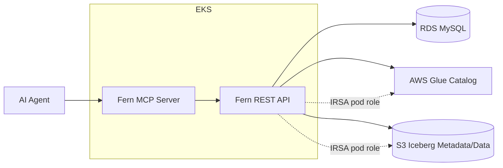

# Fern MCP Control Plane

This document describes how Fern can expose selected data lake control-plane capabilities as MCP tools for AI agents.

The MCP server should be a thin, policy-aware facade over Fern's existing API and service layer. It should not connect directly to MySQL, Glue, or S3. Keeping MCP behind Fern's own APIs preserves authorization, validation, rate limiting, audit logging, and future workflow controls in one place.

For a full API endpoint inventory mapped to use cases and candidate MCP tools, see [API_AND_MCP_USE_CASES.md](API_AND_MCP_USE_CASES.md).

## Goals

- Let AI agents inspect catalog health and Iceberg metadata without direct infrastructure access.
- Turn Fern's existing APIs into task-oriented tools with clear inputs and bounded outputs.
- Support long-running scans through durable `jobs` rows rather than long-held MCP calls.
- Keep production Glue/S3 authentication on IRSA. Local static keys and temporary credentials are test-only.
- Make maintenance recommendations explainable before any future execution workflow is added.

## Non-Goals

- Do not expose raw MySQL access through MCP.
- Do not expose raw AWS credentials, session tokens, or catalog secrets.
- Do not execute compaction, snapshot expiration, or manifest rewrite in the first MCP version.
- Do not stream large data files, manifests, or Parquet samples through MCP by default.

## Architecture

The MCP server runs as a separate Python service and calls the same Fern API surface as the UI. It uses the official MCP Python SDK/FastMCP style with Streamable HTTP transport for production deployments.

## Authentication Model

Production:
- Fern backend pods use IRSA for Glue and S3 access.
- The MCP server authenticates to Fern with an internal service token, mTLS, or the same identity layer used by users.
- MCP callers are mapped to Fern users/service principals so actions can be audited.

Local/testing:
- Developers may register Glue catalogs with temporary AWS credentials for laptop testing.
- MCP responses must redact credential-like fields even in local mode.

## Tool Set

### Catalog Tools

`fern_list_catalogs`
- Maps to `GET /api/catalogs`.
- Returns registered catalogs, type, connection state, and optional counts.
- Helps agents discover which control-plane scope they can inspect.

`fern_get_catalog`
- Maps to `GET /api/catalogs/{name}`.
- Returns sanitized catalog config and status.
- Redacts keys such as access keys, secret keys, session tokens, and profile details when configured.

`fern_test_catalog`
- Maps to `GET /api/catalogs/{name}/test`.
- Verifies Glue or Hive connectivity.
- Useful before running expensive scans.

### Inventory Tools

`fern_list_namespaces`
- Maps to namespace listing API.
- Returns namespaces in a catalog.

`fern_list_tables`
- Maps to `GET /api/tables?catalog=<name>`.
- Returns table identifiers and pagination metadata when added.
- Useful for scoping scans and investigations.

`fern_get_table_metadata`
- Maps to `GET /api/tables/{namespace}/{table}?catalog=<name>`.
- Returns normalized Iceberg metadata.
- Useful for explaining schema, partitioning, current snapshot, and table location.

### Snapshot And File Tools

`fern_get_snapshot_graph`
- Maps to `GET /api/tables/{namespace}/{table}/snapshots?catalog=<name>`.
- Helps agents explain table history and recent writes.

`fern_get_snapshot_details`
- Maps to `GET /api/tables/{namespace}/{table}/snapshots/{id}?catalog=<name>`.
- Used for targeted investigation of one snapshot.

`fern_list_manifests`
- Maps to manifest endpoints.
- Returns manifest list paths and summary counts.

`fern_list_data_files`
- Maps to data file endpoints.
- Returns file counts, sizes, partitions, and formats.
- Should cap output and prefer summaries for large tables.

`fern_get_puffin_statistics`
- Maps to Puffin/statistics endpoints.
- Helps agents explain stats availability and quality.

### Health Tools

`fern_get_catalog_health_summary`
- Maps to `GET /api/health/summary?catalog=<name>`.
- Returns cached catalog-level health.
- Good default tool for "how is this catalog doing?"

`fern_list_unhealthy_tables`
- Maps to cached table health endpoints with status filters.
- Returns warning/critical tables, scores, and top recommendations.
- Useful for ranking operational work.

`fern_get_table_health`
- Maps to table health endpoint.
- Explains one table's score, issues, and recommended maintenance.

`fern_start_health_scan`
- Maps to async health scan endpoints.
- Returns `job_id` immediately.
- Agents should use `fern_get_job` or `fern_watch_job` for progress.

### Job Tools

`fern_get_job`
- Maps to `GET /api/jobs/{job_id}`.
- Returns status, progress, message, result, and error.

`fern_list_jobs`
- Maps to `GET /api/jobs`.
- Helps agents answer "what is running right now?"

`fern_watch_job`
- Wraps job polling or SSE.
- Emits compact progress events until terminal status.

### Recommendation Tools

`fern_generate_maintenance_plan`
- Reads catalog/table health and returns grouped recommendations.
- Does not execute anything.
- Output should include command examples, expected impact, and risk notes.

`fern_explain_table_issue`
- Combines metadata, snapshots, file stats, and health findings into a plain-language diagnosis.
- Useful for incident triage and platform review prep.

## Use Cases

Operational triage:
- "Find critical tables in the production Glue catalog and explain why they are critical."
- "Show tables with high delete-file counts and propose a compaction order."

Planning:
- "Create a weekly maintenance plan grouped by namespace and maintenance type."
- "Summarize wasted storage and expected impact for the top 20 tables."

Debugging:
- "Why did this table's file count grow so much?"
- "Compare recent snapshots and tell me what changed."

Governance:
- "List catalogs Fern can see and confirm the production catalog is reachable."
- "Report tables that have not been scanned recently."

Automation support:
- "Start a light health scan, watch it, and summarize failures."
- "Prepare maintenance commands for review without executing them."

## Safety And Guardrails

- Default MCP tools should be read-only.
- Any state-changing MCP tool must require caller identity, RBAC, audit logging, and idempotency keys.
- Redact secrets from every response. Treat fields containing `secret`, `token`, `password`, `access-key`, or `session` as sensitive.
- Cap large responses and return continuation tokens or summaries.
- Prefer `job_id` workflows for long-running operations.
- Mark generated maintenance commands as proposals until an explicit execution workflow exists.
- Log MCP tool name, caller, catalog, namespace, table, job ID, status, and latency.

## MySQL Implications

The current four-table production schema is enough for the first read-mostly MCP release:
- `catalog_registry` lets tools discover and reconstruct catalogs.
- `catalog_summary` powers fast catalog-level health answers.
- `table_health` powers unhealthy-table queries and recommendation generation.
- `jobs` powers async scan progress and agent job watching.

Useful later additions:
- `audit_log` for MCP tool calls and user-visible actions.
- `scan_runs` for historical scan trends.
- `maintenance_actions` for approval/execution lifecycle.
- `table_inventory` for faster catalog browsing when Glue namespaces are large.

## First Implementation Slice

1. Build a small MCP server package that calls Fern's REST API.
2. Implement read-only catalog, table metadata, health summary, and job tools.
3. Add secret redaction and output size limits.
4. Add an MCP service token or internal auth path.
5. Add audit logging once `audit_log` exists.
6. Add guarded recommendation tools.
7. Add execution tools only after RBAC, approvals, and audit are in place.
